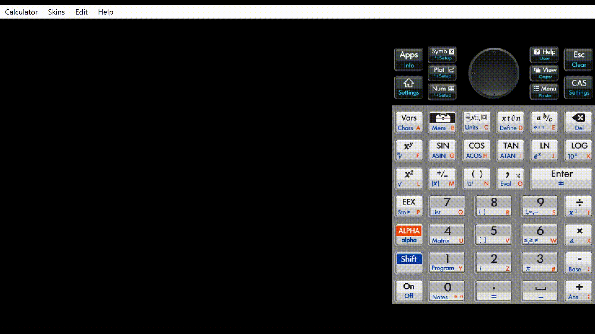

# HP Bad Apple

A program that can render Bad Apple on a HP Prime G2 Graphing Calculator.

A demo of the program running on an emulator and the physical calculator can be found [here](https://youtu.be/qDuJ1DxRWTY) and [here](https://youtu.be/izJUZ2tYca0) respectively

A web port of the program is available [here](https://draedon123.github.io/HP-Bad-Apple/)

Bad Apple video from https://youtu.be/FtutLA63Cp8 (downloaded at 240p)

# Build Instructions

## Required Installations

- [ffmpeg](https://ffmpeg.org/download.html) (added to path)
- [Node.js](https://nodejs.org/en/download)
- [HP Prime Virtual Calculator Emulator](https://www.hpcalc.org/details/8939) (optional, if you have a physical G2 calculator)
- [HP Connectivity Kit](https://www.hpcalc.org/details/8938)

## Steps

1. Clone the repository
2. Run `npm i && npm run fullbuild`
3. Open both the Connectivity Kit and either connect the physical calculator via cable or open the emulator
4. Upload the resulting `Bad Apple.hpppl` (raw text file) into the calculator via the Connectivity Kit as a program. If your IDE doesn't allow you to copy the contents of the file since it has binary characters, you may need to open the file with another IDE that supports binary, such as Notepad++
5. Go to the Program Catalog in the calculator by pressing Shift + 1 (Program)
6. Run the Bad Apple program
